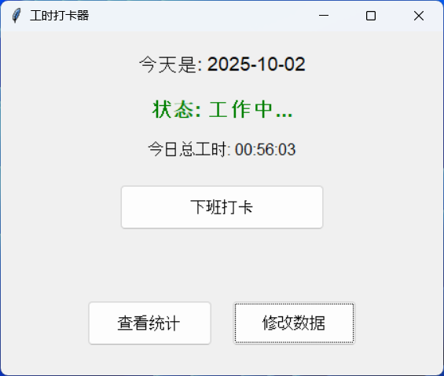

# SimpleWorkTime
A simple punch clock: One click to check in, One click to check out

------
## 主要功能
1. 上下班一键打卡，**同一天可多次上下班打卡**
2. 一键统计工作时长
3. 新增和修改时间点数据

## 用法
1. 上下班打卡：上班时打开本程序，点击“上班打卡”按钮。**随后可关闭本程序，直到需要打卡下班。**下班打卡同理，打开本程序，点击“下班打卡”。
2. 查看统计报告：点击“查看统计”按钮，输入统计时间段（默认从2025年9月1日起至今日），点击“生成报告”，即可查看统计报告。
3. 修改数据：可在统计报告中双击日期修改当日数据，也可以点击“修改数据”按钮来修改数据。
4. 时间数据记录在```work_log.db```SQLite数据库文件中，与主程序在同一目录。首次使用自动生成，请妥善保管，不要随意删除这个文件。
5. 更新本程序：直接使用新的程序替换旧的程序即可，不要动```work_log.db```文件。

## 安装
### Windows
**我自己打包好的文件似乎会被杀毒软件误报**：可以手动添加进杀毒软件白名单；也可以自己下载```worktime.py```然后直接使用python执行或者用```pyinstaller```打包：```pyinstaller --onefile --windowed --name TimeTracker worktime.py```。
1. 打开本项目的releases页面（[https://github.com/rollingQP/SimpleWorkTime/releases](https://github.com/rollingQP/SimpleWorkTime/releases)）
2. 找到最新的一个版本号，点击```SimpleWorkTime.exe```下载Windows版。
3. 把下载下来的```SimpleWorkTime.exe```放到一个合适的目录，双击即可启动。
4. 可以创建一个快捷方式到桌面方便访问。

### macOS/Linux
**并未正式支持macOS和Linux**。程序本体是Python所以大概率能直接用。
1. 下载主程序```worktime.py```，放在你认为合适的位置，并记下路径，例如```/Users/你的用户名/Downloads/SimpleWorkTime/worktime.py```
2. 在终端中输入```cd /Users/你的用户名/Downloads/SimpleWorkTime/ && python worktime.py```并回车执行。
3. 注：若shell的工作目录不是程序所在目录，可能导致数据库文件位置不正确。上一个步骤的命令已包含切换shell的工作目录至程序所在目录。未来的版本会增加适配。

## 更新
### Windows
1. 下载最新的```SimpleWorkTime.exe```。
2. 把旧的```SimpleWorkTime.exe```替换成刚刚下载好的新版。
3. 更新完成。

### macOS/Linux
1. 下载最新的```worktime.py```
2. 把旧的```worktime.py```替换成刚刚下载好的新版。
3. 更新完成。


程序预览截图：



