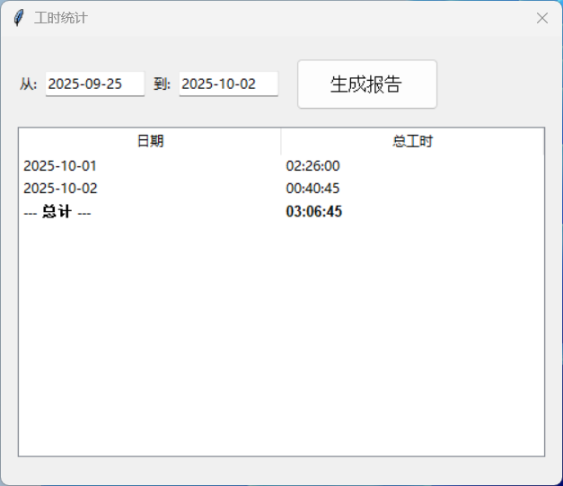

# SimpleWorkTime
A simple punch clock: One click to check in, One click to check out

------
## 主要功能
1. 上下班一键打卡，**同一天可多次上下班打卡**
2. 一键统计工作时长
3. 新增和修改时间点数据

## 用法
1. 上下班打卡：上班时打开本程序，点击“上班打卡”按钮。**随后可关闭本程序，直到需要打卡下班。**下班打卡同理，打开本程序，点击“下班打卡”。
2. 查看统计报告：点击“查看统计”按钮，输入统计时间段（默认从2025年9月1日起至今日），点击“生成报告”，即可查看统计报告。
3. 修改数据：可在统计报告中双击日期修改当日数据，也可以点击“修改数据”按钮来修改数据。
4. 时间数据记录在```work_log.db```SQLite数据库文件中，与主程序在同一目录。首次使用自动生成，请妥善保管，不要随意删除这个文件。
5. 更新本程序：直接使用新的程序替换旧的程序即可，不要动```work_log.db```文件。

程序预览截图：



